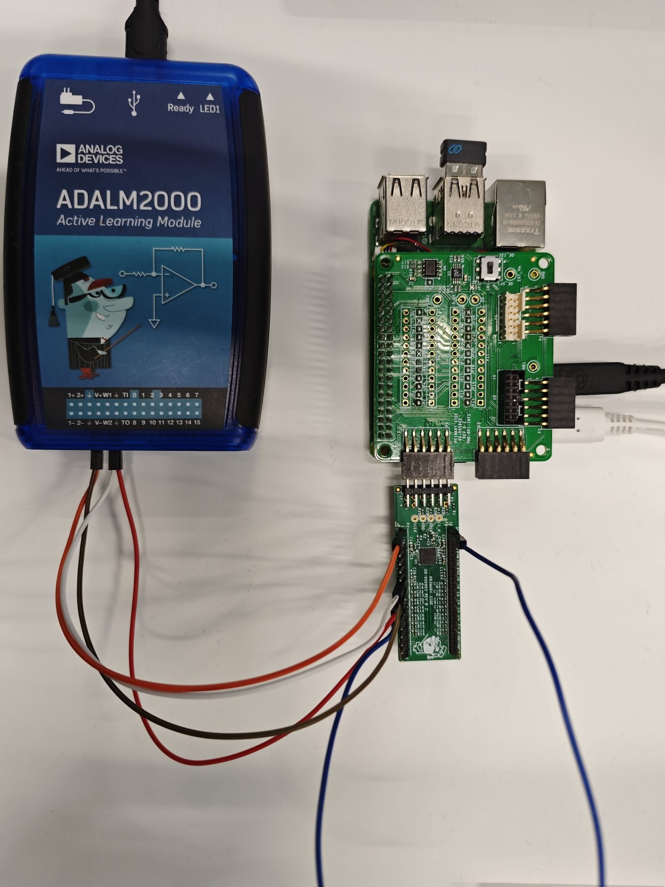
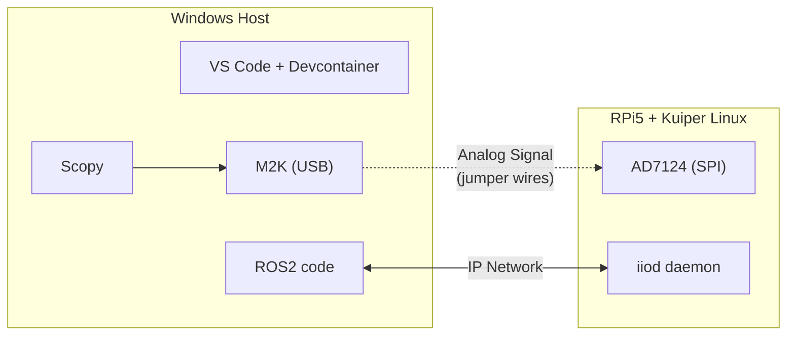

# Module 0: Workshop Setup

## Learning Objectives

By the end of this module, you will:

- Set up a Windows development environment with VS Code and Docker
- Configure a Raspberry Pi 5 with the AD7124 sensor
- Verify network connectivity between host and RPi5

## Architecture Overview





**How it works:**

- ROS2 code runs in a devcontainer on your Windows machine

- M2K connects to Windows and is controlled via Scopy to generate test signals

- RPi5 runs Kuiper Linux with the AD7124 connected via SPI

- The `iiod` daemon on RPi5 serves sensor data over the network

- Your devcontainer fetches data using IIO network context (`ip:<rpi5-ip>`)

> **Note:** The code can also run directly on the RPi5 if desired, but this workshop uses a distributed setup for easier development.

## Prerequisites

### Hardware

- Windows 10/11 PC
- Raspberry Pi 5 with power supply
- MicroSD card (32GB+)
- PMODAD7124 evaluation board
- ADALM2000 (M2K)
- Jumper wires (3+)
- Monitor, keyboard, mouse for RPi5 initial setup

### Network

- RPi5 and Windows PC on the same local network (WiFi or Ethernet)

## Success Criteria

Module 00 is complete when you can run this command from inside your devcontainer:

```bash
iio_info -u ip:<rpi5-ip>
```

And see output showing the `ad7124-8` device.

```bash
...
iio:device0: ad7124-8 (buffer capable)
            9 channels found:
                    voltage0-voltage1:  (input, index: 0, format: be:u24/32>>0)
                    11 channel-specific attributes found:
                            attr  0: filter_low_pass_3db_frequency value: 2.300000000
...
```

## Next Steps

Once setup is complete, proceed to [Module 1: Interacting with ADI Sensors](../01-adi-sensors/README.md)
