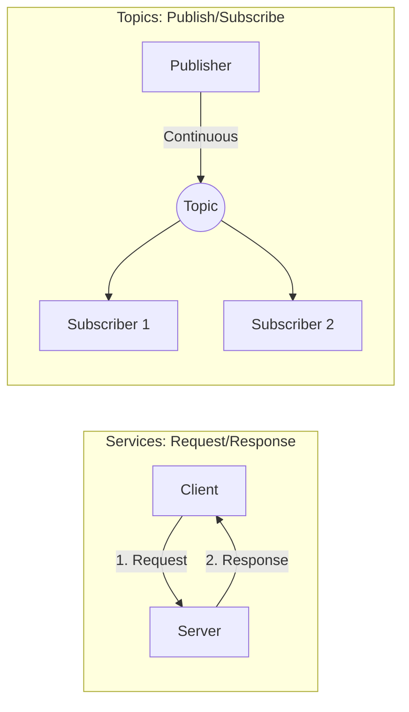
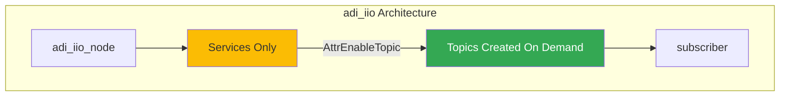
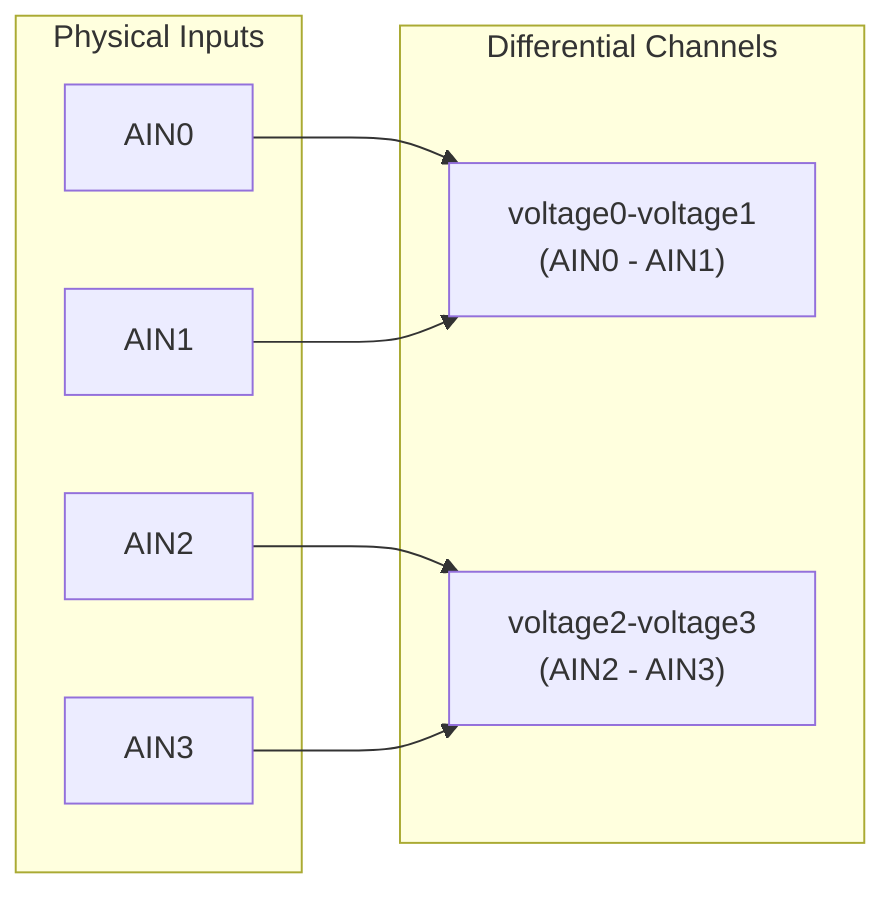
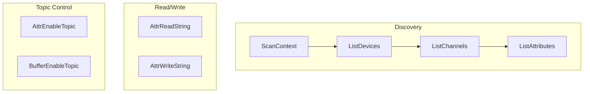
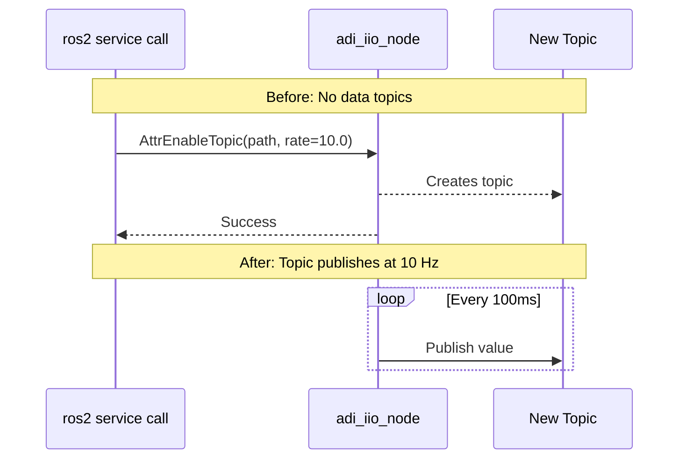
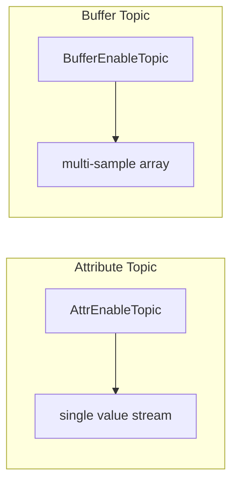

# Module 1: Interacting with ADI Sensors via ROS2

**Duration:** 20 minutes lecture + 40 minutes hands-on

---

## ROS2 Communication Patterns



| Aspect       | Services         | Topics            |
| ------------ | ---------------- | ----------------- |
| **Pattern**  | Request/Response | Publish/Subscribe |
| **Timing**   | Synchronous      | Asynchronous      |
| **Use Case** | Commands, config | Data streaming    |

<!--
Speaker Notes:
- Services are like HTTP requests - you ask, you get an answer
- Topics are like radio broadcasts - publishers transmit, anyone tunes in
- adi_iio is different from most drivers
-->

---

## The adi_iio Difference: Services-First

**Typical ROS2 driver:** Auto-publishes data on startup

**adi_iio:** NO topics by default - created ON DEMAND



**Why?** Control, efficiency, flexibility for 100s of IIO devices

---

## IIO Path Hierarchy

```
Context (root)
├── Device: ad7124-8
│   ├── Channel: input_voltage0-voltage1
│   │   ├── Attribute: raw
│   │   ├── Attribute: scale
│   │   └── Attribute: sampling_frequency
│   └── Channel: input_voltage2-voltage3
└── Device: (other IIO devices)
```

**Path Format:** `device/channel/attribute`

```
"ad7124-8"                              → Device
"ad7124-8/input_voltage0-voltage1"      → Channel
"ad7124-8/input_voltage0-voltage1/raw"  → Attribute
```

---

## AD7124-8 Differential Channels



Channel naming: `input_voltageX-voltageY` = Differential (AINX - AINY)

---

## adi_iio Services



---

## From Services to Topics



---

## Attribute Topics vs Buffer Topics

| Attribute Topics        | Buffer Topics     |
| ----------------------- | ----------------- |
| One attribute at a time | Multiple channels |
| String messages         | Structured data   |
| Lower rates             | High-performance  |



---

## Complete Workflow


1. `ros2 run adi_iio adi_iio_node`
2. `ListDevices` → `ListChannels` → `ListAttributes`
3. `AttrReadString` / `AttrWriteString`
4. `AttrEnableTopic` or `BufferEnableTopic`
5. `ros2 topic echo` or custom nodes

---

## Hands-on Overview

| Part | Activity                | Duration |
| ---- | ----------------------- | -------- |
| 1    | Discovery & IIO Paths   | 10 min   |
| 2    | Read Attributes         | 5 min    |
| 3    | Write Attributes        | 5 min    |
| 4    | Enable Attribute Topics | 10 min   |
| 5    | Buffer Topics           | 10 min   |

**Hardware:** AD7124-8 ADC + Raspberry Pi 5 + Docker

---

## Key Takeaways

1. **Services-First:** adi_iio uses services; topics created on demand

2. **IIO Paths:** `device/channel/attribute` hierarchy

3. **Discovery:** ScanContext → ListDevices → ListChannels → ListAttributes

4. **Bridge:** AttrEnableTopic / BufferEnableTopic create topics

5. **Control Flow:** Services for config, Topics for streaming
