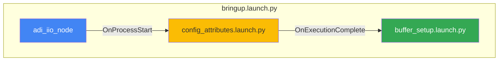

# Module 2: Sensor Bringup with Launch Files

**Duration:** 15 minutes lecture + 50 minutes hands-on

---

## Recap: Module 1

In Module 1, we learned to interact with ADI sensors manually:

```bash
# Start node
ros2 run adi_iio adi_iio_node --ros-args -p uri:=ip:analog.local

# Configure attributes
ros2 service call /adi_iio_node/AttrWriteString ...

# Enable topics
ros2 service call /adi_iio_node/BufferEnableTopic ...
```

**Problem:** Manual steps don't scale and aren't reproducible.

---

## The Solution: Launch Files

Launch files automate node orchestration:

```python
# One command to start everything
ros2 launch ad7124_workshop bringup.launch.py
```

**Benefits:**
- Reproducible sensor bringup
- Shareable configurations
- Composable components

---

## Launch File Architecture



---

## Event-Driven Orchestration

```python
# When node starts -> run config
on_node_start = RegisterEventHandler(
    OnProcessStart(
        target_action=adi_iio_node,
        on_start=[config_attributes],
    )
)

# When config completes -> run buffer setup
on_config_complete = RegisterEventHandler(
    OnExecutionComplete(
        target_action=config_attributes,
        on_completion=[buffer_setup],
    )
)
```

---

## Key Launch File Components

| Component                  | Purpose                                         |
| -------------------------- | ----------------------------------------------- |
| `Node`                     | Start a ROS2 node                               |
| `ExecuteProcess`           | Run a shell command                             |
| `IncludeLaunchDescription` | Include another launch file                     |
| `RegisterEventHandler`     | React to events                                 |
| `OnProcessStart`           | Trigger when a process starts                   |
| `OnProcessExit`            | Trigger when ExecuteProcess exits               |
| `OnExecutionComplete`      | Trigger when IncludeLaunchDescription completes |

---

## YAML Configuration

Separate configuration from code:

```yaml
# config/ad7124.yaml
adi_iio_node:
  ros__parameters:
    uri: "ip:analog.local"
```

```python
# In launch file
adi_iio_node = Node(
    package='adi_iio',
    executable='adi_iio_node',
    parameters=[config_file],  # Load from YAML
)
```

---

## Service Calls in Launch Files

Use `ExecuteProcess` to call services:

```python
ch0_scale = ExecuteProcess(
    cmd=[[
        FindExecutable(name='ros2'),
        ' service call ',
        '/adi_iio_node/AttrWriteString ',
        'adi_iio/srv/AttrWriteString ',
        '"{attr_path: \'ad7124-8/input_voltage0-voltage1/scale\', ',
        'value: \'0.000149011\'}"',
    ]],    shell=True,
)
```

---

## Hands-on Overview

| Part | Activity                    | Duration |
| ---- | --------------------------- | -------- |
| 1-3  | Setup & explore package     | 20 min   |
| 4-5  | Exercise 1: Complete config | 20 min   |
| 6-7  | Exercise 2: Complete buffer | 15 min   |
| 8    | Exercise 3: Verification    | 10 min   |

**Goal:** Complete the launch files and run full sensor bringup

---

## Key Takeaways

1. **Launch files automate** what we did manually in Module 1

2. **Event handlers sequence** operations correctly

3. **YAML configs** separate parameters from code

4. **Composable launch files** = reusable building blocks

5. **One command** brings up the entire sensor system
