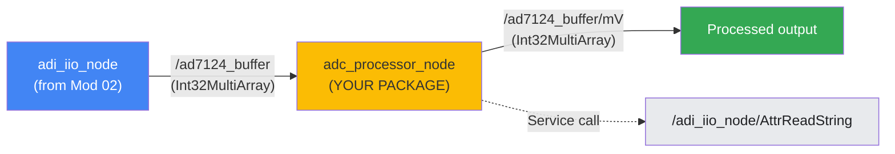

# Module 3: Creating a Data Processing Package

## Overview

Learn how to create a ROS2 Python package that processes raw ADC buffer data from Module 02's infrastructure. You will build a complete data processing node that retrieves scale values via service clients, applies scaling to convert raw ADC counts to millivolts, and publishes the processed data.

## Prerequisites

- Module 01 completed (CLI interaction with adi_iio services)
- Module 02 completed (launch file automation with `/ad7124_buffer` topic streaming)
- Basic Python familiarity

**Prerequisite Verification:**
```bash
ros2 launch ad7124_workshop bringup.launch.py
# In another terminal:
ros2 topic echo /ad7124_buffer --once
# Should show Int32MultiArray with data
```

## Learning Objectives

By the end of this module, you will be able to:

1. **Create a ROS2 Python package** using `ros2 pkg create`
2. **Configure package dependencies** in `package.xml` for ADI packages
3. **Set up entry points** in `setup.py` for executable nodes
4. **Use synchronous service clients** to programmatically call ROS2 services
5. **Implement subscribe/publish with transformation** pattern
6. **Use logging levels** for development vs production
7. **Extend existing launch files** to integrate new packages

## Module Contents

| File                | Purpose                      |
| ------------------- | ---------------------------- |
| `hands-on-guide.md` | Step-by-step practical guide |
| `exercises/`        | Challenge-based exercises    |
| `code-templates/`   | Minimal starting template    |

## Key Concept: Data Processing Pipeline



## Hands-on Parts

| Stage | Goal                            | Milestone                                           |
| ----- | ------------------------------- | --------------------------------------------------- |
| 1     | Package Creation + Minimal Node | Package builds, node logs buffer data               |
| 2     | Processing Implementation       | Service client works, `/ad7124_buffer/mV` publishes |
| 3     | Launch Integration              | Single command brings up entire pipeline            |
