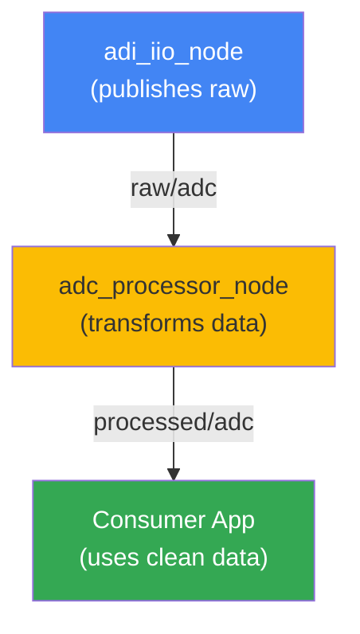

# Module 3: Creating a Data Processing Package

**Duration:** ~2 hours (theory + hands-on)

---

## Recap: Module 2

**What We Accomplished:**
- Created launch files to automate sensor bringup
- Configured buffered streaming of raw ADC topics
- Learned parameter passing and parameter files
- Achieved reproducible, version-controlled sensor configurations

**Key Takeaway:** Launch files eliminate manual CLI commands and ensure consistency across deployments.

---

## The Next Step: Data Processing

**Raw Data → Meaningful Values**

Raw ADC readings need transformation:
- **Scaling** (digital counts → physical units)
- **Filtering** (noise reduction, averaging)
- **Aggregation** (batching, windowing)
- **Calibration** (offset/gain correction)

**Why?** Downstream algorithms need usable data, not raw counts.

---

## What We'll Build



---

## Creating a ROS2 Package

**Use the built-in CLI:**

```bash
ros2 pkg create --build-type ament_python \
  --dependencies rclpy std_msgs \
  adc_processor_node
```

**What this does:**
- Scaffolds directory structure
- Creates package.xml with dependencies
- Generates setup.py entry points
- Ready for `colcon build`

---

## Package Structure

**package.xml** - Metadata
```xml
<package format="3">
  <name>adc_processor_node</name>
  <maintainer email="dev@example.com">Analog Devices</maintainer>
  <license>Apache-2.0</license>
  <depend>rclpy</depend>
  <depend>std_msgs</depend>
</package>
```

**setup.py** - Python entry points
```python
entry_points={
    'console_scripts': [
        'processor=adc_processor_node.processor:main',
    ],
},
```

---

## Service Clients: Programmatic Calls

**CLI approach (previous module):**
```bash
ros2 service call /iio/read_attr ros2_iio_interfaces/srv/AttrReadString '{attr: scale}'
```

**Programmatic approach (this module):**
```python
client = node.create_client(AttrReadString, '/iio/read_attr')
request = AttrReadString.Request(attr='scale')
future = client.call_async(request)
rclpy.spin_until_future_complete(node, future)
response = future.result()
scale = float(response.response)
```

Benefits: Error handling, async integration, testability.

---

## The Processing Pattern

**Subscribe → Transform → Publish**

```python
def __init__(self):
    self.subscription = self.create_subscription(
        Int32MultiArray, 'raw/adc', self.callback, 10)
    self.publisher = self.create_publisher(
        Int32MultiArray, 'processed/adc', 10)

def callback(self, msg):
    # Transform raw data (scale to mV as integers)
    processed = [int(x * scale) for x in msg.data]

    # Publish result
    output = Int32MultiArray(data=processed)
    self.publisher.publish(output)
```

Decoupling: Input topic independent of output topic name.

---

## Logging for Development

**Log levels matter:**
- `DEBUG` - Every state change, variable value
- `INFO` - Major milestones, startup messages
- `WARN` - Recoverable issues
- `ERROR` - Failures

**In code:**
```python
self.get_logger().debug(f"Raw sample: {raw}")
self.get_logger().info(f"Processing {len(raw)} samples")
```

**At runtime:**
```bash
ros2 run adc_processor_node processor --ros-args --log-level debug
```

---

## Launch Integration

**Extending Module 2 launch:**

```python
from launch import LaunchDescription
from launch_ros.actions import Node

def generate_launch_description():
    adi_node = Node(package='adi_iio', executable='iio')
    processor_node = Node(package='adc_processor_node', executable='processor')

    return LaunchDescription([
        adi_node,
        processor_node,
    ])
```

**Event handlers:** React to node state changes (crash, shutdown).

---

## Hands-on Overview

| Stage      | Focus                              | Output                            |
| ---------- | ---------------------------------- | --------------------------------- |
| **Part A** | Create package, add node skeleton  | `adc_processor_node` executable   |
| **Part B** | Implement subscription + publisher | Processing pipeline operational   |
| **Part C** | Integration + launch file          | Full sensor → processed data flow |

Each stage builds on previous; test incrementally.

---

## Key Takeaways

- **ROS2 packages** organize code with standardized structure
- **Service clients** programmatically retrieve configuration
- **Subscribe → Transform → Publish** is the core pattern
- **Logging** is essential for debugging complex systems
- **Launch files** orchestrate multi-node systems
- **Testing incrementally** prevents integration surprises

**Next Steps:** Start with Part A!
